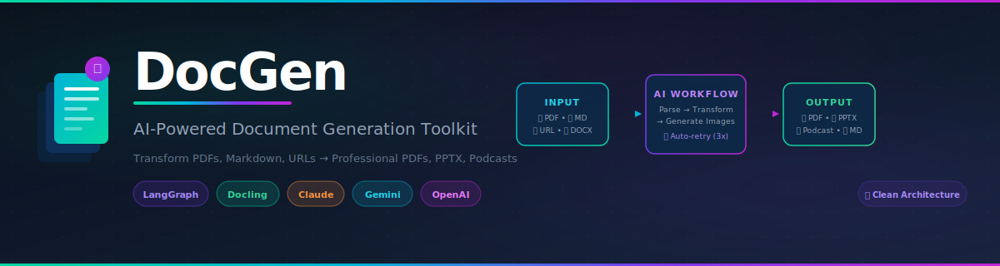

<div align="center">



<br/>

<p>
  <strong>🚀 Transform any content into professional documents with AI</strong>
  <br/>
  <em>From Research Papers to Pitch Decks • From Web Articles to Study Guides</em>
</p>

[](https://prism-docs-pink.vercel.app/generate)
[](https://opensource.org/licenses/MIT)

<br/>

</div>

---

## 🌟 What is PrismDocs?

PrismDocs is an AI-powered platform that turns your raw content—PDFs, URLs, notes, or images—into polished, professional documents in seconds. Whether you need a pitch deck from meeting notes or a podcast from a research paper, PrismDocs handles the transformation for you.

---

## 🎮 How to Use

Using PrismDocs is simple. No coding required—just bring your own API key (OpenAI, Gemini, or Claude).

### 1. Choose Your Source 📥

Upload files or paste links to what you want to transform:

- **Documents**: PDF, DOCX, Markdown, Text files.
- **Web**: Paste any URL (articles, blog posts).
- **Images**: Upload screenshots or diagrams (OCR included).

### 2. Select Your Output 📤

Choose what you want to create:

- **📕 Reports (PDF)**: Professional, formatted documents with table of contents.
- **📊 Presentations (PPTX)**: Ready-to-present slide decks with 16:9 layouts.
- **🎙️ Podcasts (Beta)**: Multi-speaker audio conversations based on your content.
- **🧠 Mind Maps**: Visual hierarchies to brainstorm or summarize complex topics.
- **📝 Markdown**: Clean, structured text for documentation.

### 3. Customize & Generate ✨

- **Select Provider**: Choose between Gemini, Claude, or OpenAI.
- **Pick a Style**: Adjust the tone (Professional, Creative, Academic).
- **Generate**: Watch as PrismDocs analyzes your content and builds your document in real-time.

---

## 🎨 Interactive Studios

Beyond standard documents, explore our specialized creative studios:

### 💡 Idea Canvas

_Perfect for: Brainstorming & Planning_

- Answer guided questions to build a decision tree.
- Automatically generates an implementation spec pack (PDF + Markdown + Visual Summary).

### 🧠 Mind Map Studio

_Perfect for: Learning & Analysis_

- Visualize complex relationships from any document.
- **Modes**: Summarize, Brainstorm, Create Action Plans.
- **Interactive**: Zoom, pan, and explore nodes.
- **Export**: Save as PNG or SVG.

### 🎙️ Audio Studio (Beta)

_Perfect for: Learning on the Go_

- Turn long articles or papers into engaging audio conversations.
- Select "Host" and "Guest" personalities.
- Audio generated using advanced Gemini Audio models.

### 🖼️ Image Studio

_Perfect for: Visuals & Diagrams_

- Generate AI images that match your document's context.
- Edit existing images or generate new diagrams.
- Export as vector (SVG) or raster (PNG).

---

## ⚡ Get Started

You can try the live beta version immediately:

[**👉 Launch PrismDocs Studio**](https://prism-docs-pink.vercel.app/generate)

_(Note: You will need your own API keys for Gemini, OpenAI, or Claude to generate content.)_

---

## 💻 For Developers

PrismDocs is open source! You can self-host it or contribute to the code.

**Quick Run (Docker):**

```bash
git clone https://github.com/nitishkmr005/PrismDocs.git
cd PrismDocs
docker-compose up --build
```

Open [http://localhost:3000](http://localhost:3000)

**Documentation:**

- [✨ Use Cases](docs/USE_CASES.md)
- [🏗️ Architecture](docs/ARCHITECTURE.md)
- [📡 API Reference](docs/API.md)
- [🛠️ Development Guide](docs/DEVELOPMENT.md)

---

## 🗺️ Roadmap

- [x] **Mind Maps**: Interactive viewer and export.
- [x] **Podcast Generation**: Multi-speaker Audio (Beta).
- [ ] **Template Library**: Pre-built templates for resumes and papers.
- [ ] **PyPI Package**: `pip install prismdocs` (Planned).

---

## 📄 License

MIT License - See [LICENSE](LICENSE) file for details.

<div align="center">
  <sub>Built with ❤️ by Nitish Harsoor</sub>
</div>
