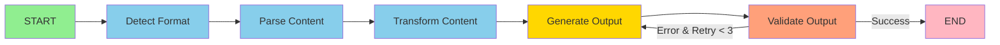

# Architecture

LangGraph workflow orchestration with clean architecture. No LLM required.

## Workflow Diagram



## Nodes

| Node | Input | Output | Library |
|------|-------|--------|---------|
| Detect Format | file path/URL | ContentFormat | - |
| Parse Content | path + format | raw_content, metadata | Docling, MarkItDown |
| Transform | raw_content | structured_content | - |
| Generate Output | structured_content | output_path | ReportLab, python-pptx |
| Validate | output_path | errors[] | - |

## Workflow State

```python
WorkflowState = {
    "input_path": str,
    "input_format": str,       # MARKDOWN, PDF, URL, etc.
    "output_format": str,      # pdf, pptx
    "raw_content": str,
    "structured_content": dict,
    "output_path": str,
    "errors": list[str],
    "metadata": dict,
    "_retry_count": int
}
```

## Clean Architecture

```
Domain (zero deps)     → models, enums, exceptions, interfaces
Application (use cases) → parsers, generators, nodes, workflow
Infrastructure (I/O)   → Docling, MarkItDown, file system
```

## LangGraph Implementation

```python
workflow = StateGraph(WorkflowState)
workflow.add_node("detect_format", detect_format_node)
workflow.add_node("parse_content", parse_content_node)
workflow.add_node("transform_content", transform_content_node)
workflow.add_node("generate_output", generate_output_node)
workflow.add_node("validate_output", validate_output_node)

workflow.set_entry_point("detect_format")
workflow.add_edge("detect_format", "parse_content")
workflow.add_edge("parse_content", "transform_content")
workflow.add_edge("transform_content", "generate_output")
workflow.add_edge("generate_output", "validate_output")
workflow.add_conditional_edges("validate_output", should_retry,
    {"retry": "generate_output", "end": END})
```

Reference: `src/doc_generator/application/graph_workflow.py`
